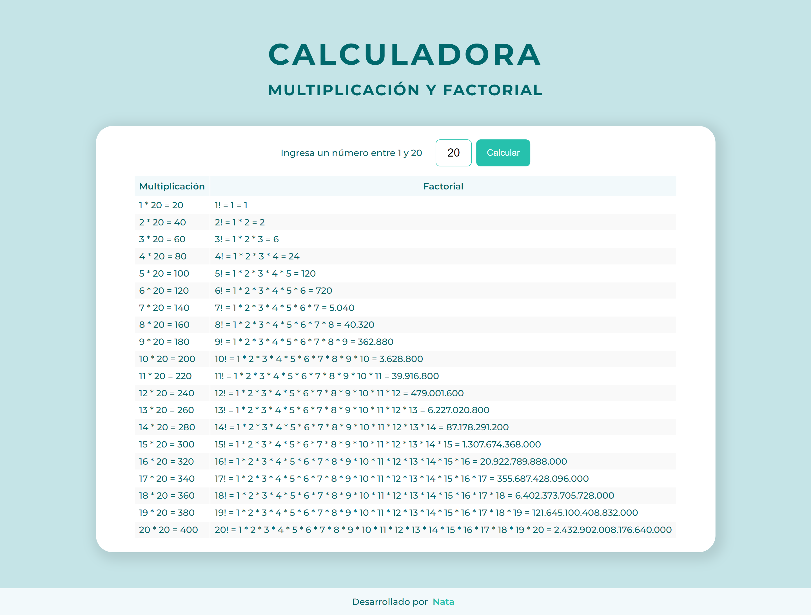

# Desafío - Multiplicación




En este desafío validaremos nuestros conocimientos de funciones, ECMAScript 6 (ES6) y Ciclos.

## Descripción

Una empresa del área educacional te ha contratado para desarrollar programas que les permitan realizar distintos tipos de cálculos matemáticos para facilitar el aprendizaje de sus estudiantes.

Para ello, en una primera etapa, te han pedido un programa que al ingresar un número, obtenga las tablas de multiplicar desde el 1 hasta el número ingresado. Además, debe mostrar el factorial para los mismos números. El resultado debe ser mostrado por la consola del navegador, por ejemplo, si ingresan el número 3 en la consola deberían obtener el siguiente resultado:

```
1 x 3 = 3
2 x 3 = 6
3 x 3 = 9
Factorial de 1 es: 1
Factorial de 2 es: 2
Factorial de 3 es: 6
```

## Requerimientos

1. Crear una función para solicitar el número y validar antes de mostrar el resultado que el número ingresado se encuentre entre 1 y 20. En caso de que no corresponda al rango, mostrar un mensaje al usuario: "número fuera del rango".

2. Utilizar las características propias de ES6 como let y arrow function para desarrollar el ejercicio.

3. Generar y mostrar por consola el resultado de las operaciones.

4. Aplicar un ciclo for anidado para obtener el factorial del número ingresado.
